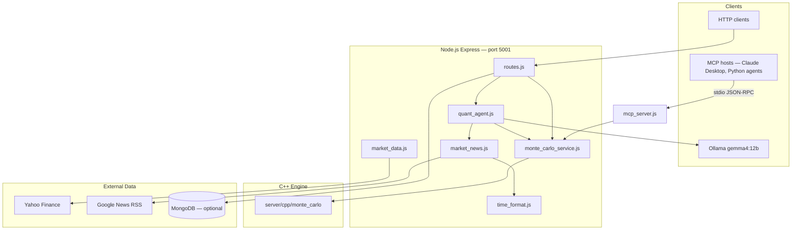

# MonteCarloSuite — Multi-Threaded C++ Quantitative Engine & AI Risk Backend

**MonteCarloSuite** is a high-performance quantitative finance backend built around a native **multi-threaded C++17 Monte Carlo engine** for sub-millisecond option pricing, risk sensitivity computation ($\Delta, \Gamma, \nu, \Theta, \rho$), and discrete delta-hedging simulation. An **AI risk agent** (local Ollama `gemma4:12b`, **Gemini** on Docker/Render, or optional Groq) provides AI-driven risk audits over C++ pricing output, with optional tool calls for follow-up requests.

The stack also includes an **Express REST API**, a **JSON-RPC Model Context Protocol (MCP) server**, a **Live Financial News pipeline**, and Yahoo Finance market data integration.

> **Product focus:** The primary AI workflow is `POST /api/agent/analyze` — C++ pricing + LLM risk summary (Ollama locally, Gemini on deploy).

---

## 1. System Architecture



| Component | Path | Role |
| :--- | :--- | :--- |
| C++ Monte Carlo engine | `server/cpp/` | Pricing, Greeks, Asian options, delta hedge, price paths |
| Express REST API | `server/server.js`, `server/src/routes.js` | HTTP endpoints |
| MCP server | `server/mcp_server.js` | Standalone stdio JSON-RPC tool host |
| Quant agent | `server/utils/quant_agent.js` | LLM tool-calling agent (Ollama / Gemini / Groq via `llm_provider.js`); `gemma_agent.js` re-exports for compat |
| Market data | `server/utils/market_data.js` | Yahoo Finance spot + IV |
| Options chain | `server/utils/options_chain.js` | Yahoo options chain, ATM picker |
| Vol surface | `server/utils/vol_surface.js` | IV surface from chain |
| Market news | `server/utils/market_news.js` | Google News RSS headlines |
| Timestamps | `server/utils/time_format.js` | ISO 8601 UTC + display formatting |
| Python agents | `examples/agent/` | Optional offline Ollama + MCP scripts |
| React UI | `client/src/components/` | CRA dashboard — see **§10** |

---

## 2. C++ Quantitative Core (`server/cpp/src/monte_carlo.cpp`)

The core numerical calculations are implemented in C++17, compiled with `-O3 -march=native -pthread`. The binary is stateless and communicates via CLI arguments and `stdout` JSON.

### 2.1 Build

```bash
cd server/cpp && ./build.sh
# or: mkdir -p build && cd build && cmake -DCMAKE_BUILD_TYPE=Release .. && make -j$(nproc)
```

Output binary: `server/cpp/monte_carlo`

### 2.2 CLI Signature

```bash
./monte_carlo <S0> <K> <r> <sigma> <T> <isCall> <numTrials> <benchmark_mode> [threads] [numSteps/iterations] [rebalanceFreq] [txCostPct]
```

| Arg | Type | Description |
| :--- | :--- | :--- |
| `S0`, `K` | `double` | Spot and strike ($> 0$) |
| `r`, `sigma`, `T` | `double` | Rate, volatility, time to maturity |
| `isCall` | `int` | `1` = Call, `0` = Put |
| `numTrials` | `int` | Monte Carlo path count |
| `benchmark_mode` | `int` | `0`–`5` (see below) |
| `threads` | `int` | Worker threads (`0` = auto) |
| `numSteps` | `int` | Steps for Asian/hedge modes |
| `rebalanceFreq` | `int` | Rebalance interval (Mode 5) |
| `txCostPct` | `double` | Transaction cost fraction (Mode 5) |

### 2.3 Execution Modes

| Mode | Name | Output |
| :---: | :--- | :--- |
| `0` | European option | `optionPrice`, `confidence`, `executionTimeMs` |
| `1` | Performance benchmark | `statistics`, `runs[]` |
| `2` | Arithmetic Asian option | `optionType: "asian"`, `numSteps`, `optionPrice` |
| `3` | CRN finite-difference Greeks | `greeks: { delta, gamma, vega, theta, rho }` |
| `4` | Price paths generator | `paths[][]` (deterministic seed `12345`) |
| `5` | Discrete delta-hedging simulator | `summaryStatistics`, `pnlDistribution`, `samplePaths` |

Example — Mode 3 Greeks:

```bash
./monte_carlo 100 100 0.05 0.20 1.0 1 100000 3 0
```

```json
{
  "executionTimeMs": 1.52,
  "optionPrice": 10.450123,
  "greeks": { "delta": 0.635, "gamma": 0.018, "vega": 38.12, "theta": -6.79, "rho": 25.46 },
  "threadsUsed": 8
}
```

### 2.4 Key Formulations

**Black-Scholes:** standard $d_1$, $d_2$ with $\text{erfc}$-based $N(x)$.

**CRN Greeks:** single normal draw $Z_i$ per path reused across bumped evaluations; central differences on $S$, $\sigma$, $T$, $r$.

**Delta hedge (Mode 5):** discrete rebalancing with cash accrual $C_k = C_{k-1} e^{r\Delta t}$, proportional transaction costs, terminal liquidation P&L; reports mean/std P&L, 95% VaR/CVaR.

---

## 3. Express REST API (`server/src/routes.js`)

Base URL: `http://localhost:5001` (override with `PORT`).

### 3.1 Health & Status

| Method | Path | Description |
| :--- | :--- | :--- |
| `GET` | `/api/health` | Server liveness |
| `GET` | `/api/implementation-status` | C++ vs JS engine availability |

### 3.2 Option Pricing & Simulation

| Method | Path | Description |
| :--- | :--- | :--- |
| `POST` | `/api/black-scholes` | European MC (auto-selects C++ or JS) |
| `POST` | `/api/black-scholes/cpp` | European MC via C++ |
| `POST` | `/api/black-scholes/js` | European MC via JavaScript |
| `POST` | `/api/analytical-black-scholes` | Closed-form Black-Scholes |
| `POST` | `/api/validate-model` | MC price vs analytical |
| `POST` | `/api/asian-option` | Arithmetic Asian option |
| `POST` | `/api/greeks` | CRN Greeks |
| `POST` | `/api/price-paths` | GBM trajectory matrix (Mode 4) |
| `POST` | `/api/simulation/delta-hedge` | Delta-hedging simulator (Mode 5) |

**Common request body** (pricing endpoints):

```json
{ "S0": 100, "K": 100, "r": 0.05, "sigma": 0.20, "T": 1.0, "isCall": true, "numTrials": 100000 }
```

Asian and delta-hedge accept optional `numSteps`, `rebalanceFreq`, `txCostPct`.

> **Benchmark note:** There is no `POST /api/benchmark` REST route. C++ vs JS latency comparison is available via the MCP `run_benchmark` tool, or by calling `/api/black-scholes/cpp` and `/api/black-scholes/js` separately.

### 3.3 Market Data & News

| Method | Path | Description |
| :--- | :--- | :--- |
| `GET` | `/api/market/:ticker` | Spot, ATM implied vol, 252-day historical vol |
| `GET` | `/api/market-data/:symbol` | Alias of above |
| `GET` | `/api/market-news/:symbol?count=5` | Google News RSS headlines (max 20) |
| `GET` | `/api/options-chain/:symbol` | Nearest-expiry options chain + ATM IV |

News articles include `pubDateIso`, `pubDateFormatted`, `ageMinutes`, and wall-clock `fetchedAt` (ISO 8601 UTC). Normalization is handled by `time_format.js`.

The options chain endpoint returns nearest-expiry calls and puts with implied vol.

### 3.4 AI Risk Copilot & Streaming

| Method | Path | Description |
| :--- | :--- | :--- |
| `POST` | `/api/agent/stream` | **Primary interactive streaming endpoint** (SSE): computes C++ math, pre-fetches Google News, and streams tokens with custom trader directives (`customPrompt`) |
| `POST` | `/api/agent/analyze` | Non-streaming batch risk audit returning structured JSON (`recommendation`, `impactAnalysis`, `comparison`, `marketNews`, `gemmaText`) |

### 3.5 Model Context Protocol (MCP) HTTP Endpoint

| Method | Path | Description |
| :--- | :--- | :--- |
| `POST` | `/api/mcp` | Standard JSON-RPC 2.0 endpoint dispatching to all 8 quantitative MCP tools over HTTP |

### 3.6 Simulation History (MongoDB)

| Method | Path | Description |
| :--- | :--- | :--- |
| `GET` | `/api/history` | List saved simulations |
| `POST` | `/api/history` | Persist a simulation run |
| `GET` | `/api/history/:id` | Fetch by MongoDB ObjectId |
| `PUT` | `/api/history/:id` | Update name/description/tags |

Requires MongoDB (`MONGO_URI`); server starts without DB if connection fails.

**POST body** (`POST /api/history`):

```json
{
  "name": "AAPL European Run",
  "description": "Optional notes",
  "tags": ["european", "AAPL"],
  "simulationType": "black-scholes",
  "parameters": { "S0": 100, "K": 100, "r": 0.05, "sigma": 0.20, "T": 1.0, "isCall": true, "numTrials": 100000 },
  "result": { "optionPrice": 10.45, "confidenceLower": 10.40, "confidenceUpper": 10.50, "executionTimeMs": 1.52 }
}
```

`simulationType` must be one of the enum values in `SimulationHistory.js`: `"black-scholes"`, `"asian"`, `"greeks"`, `"delta-hedge"`. `parameters` and `result` are free-form objects.

---

## 4. Quant Agent (`server/utils/quant_agent.js`)

LLM integration via `server/utils/llm_provider.js` — switchable by env (backend only):

| `LLM_PROVIDER` | Backend | Model (default) | Notes |
| :--- | :--- | :--- | :--- |
| `ollama` (default) | Local Ollama `POST /api/chat` | `gemma4:12b` | Requires Ollama running locally |
| `gemini` or `google` | Google Gemini OpenAI-compatible API | `gemini-flash-lite-latest` | **Docker/Render default** — set `GEMINI_API_KEY` and `LLM_PROVIDER=gemini` |
| `groq` | Groq OpenAI-compatible API | `llama-3.3-70b-versatile` | Optional alternative; set `GROQ_API_KEY` and `LLM_PROVIDER=groq` |

**Local dev** (`server/.env`):

```bash
LLM_PROVIDER=ollama
OLLAMA_URL=http://localhost:11434
OLLAMA_MODEL=gemma4:12b
OLLAMA_TIMEOUT_MS=0
```

**Deploy** (root `.env` for Docker Compose, Render dashboard for production):

```bash
LLM_PROVIDER=gemini
GEMINI_API_KEY=...                   # store in server/.env (gitignored), referenced by Compose
GEMINI_MODEL=gemini-flash-lite-latest
```

If `LLM_PROVIDER=gemini` without `GEMINI_API_KEY`, agent routes return a clear fallback error.

### 4.1 Registered Tools

| Tool | Handler |
| :--- | :--- |
| `get_market_news` | `market_news.getMarketNews(symbol)` — **Google News RSS only** (not arbitrary web search) |
| `calculate_greeks` | `monteCarloService.calculateGreeks(...)` — C++ engine |

### 4.2 Entry Points

| Function | Used By | Purpose |
| :--- | :--- | :--- |
| `runQuantAgent(prompt, { skipTools })` | `POST /api/agent/analyze` | Risk audit; analyze route passes `skipTools: true` |

### 4.3 Temporal Semantics

News articles carry wall-clock `fetchedAt` / `pubDateIso`. The agent system prompt instructs the model to compare events using explicit ISO 8601 timestamps and to use embedded prompt data rather than re-fetching via tools on the first pass.

### 4.4 Exact LLM input (`POST /api/agent/analyze`)

`routes.js` runs C++ pricing first, then passes the rendered user prompt to `runQuantAgent(prompt, { skipTools: true })` in `quant_agent.js`. The provider (`llm_provider.js`) sends a non-streaming chat request with JSON mode enabled:

```http
POST {OLLAMA_URL}/api/chat
Content-Type: application/json

{ "model": "<OLLAMA_MODEL>", "stream": false, "messages": [...], "tools": [...] }
```

(Gemini and Groq use OpenAI-compatible chat completions URLs when `LLM_PROVIDER=gemini` or `groq`.)

#### LLM call #1 — initial payload

**Two messages** are always sent. Tool schemas are attached **only when `skipTools` is false** (not used on `/api/agent/analyze`).

**Message 1 — `role: "system"`** (from `runQuantAgent`):

```text
You are an autonomous Senior Quantitative Risk Analyst & MFT Volatility Trader. The user message already contains current C++ Monte Carlo prices, Greeks, and market news headlines — use that embedded data for your analysis. Do NOT call tools to re-fetch the same symbol or parameters unless the user explicitly asks for different inputs. Tools (get_market_news, calculate_greeks) are for follow-up questions only.

Respond with valid JSON only: {"recommendation":"BUY|SELL|HOLD","reasoning":"..."}. Put your full plain-English analysis (bullet points, comparisons, justification) in the reasoning field. IMPORTANT: Simulated price paths use simulationTime ISO timestamps (synthetic replay). Live news from get_market_news uses wall-clock fetchedAt/pubDateIso and may be from a different calendar date. Always compare events using explicit ISO 8601 UTC timestamps — never assume news and simulated ticks are contemporaneous.
```

**Message 2 — `role: "user"`** (built in `routes.js` after C++ runs):

```text
You are a Senior Quantitative Risk Analyst. Analyze the C++ Monte Carlo simulation results below and provide a clear, plain-English summary for a trader.

WALL-CLOCK TIME (analysis run): <ISO 8601 UTC at request time>

COMPUTATION RESULTS:
- Option Style: <Call|Put>
- Spot Price (S0): $<S0>, Strike (K): $<K>, Volatility (σ): <sigma×100>%, Expiry: <T> years
- European Monte Carlo Fair Value: $<eurPrice>
- Asian Option Fair Value (Path Average): $<asianPrice> (Path Discount: <discountVal>%)
- Greeks: Delta (Δ): <delta>, Vega (ν): <vega>, Theta (Θ): <theta>

MARKET NEWS (<symbol>, fetched <fetchedAtDisplay|fetchedAt>):
1. "<title>" — <source> (<pubDateFormatted|pubDateIso>)
2. ...

INSTRUCTIONS:
1. Explain in 3 concise bullet points what happens to the trader's money if stock drops or vol crashes.
2. Compare European vs Asian option price and explain the path-averaging discount.
3. Note whether any headline above could affect vol or directional risk for this option.
4. Give a final BUY, SELL, or HOLD risk recommendation with justification.

OUTPUT FORMAT: Respond with JSON only: {"recommendation":"BUY|SELL|HOLD","reasoning":"..."} — put your full analysis in reasoning.
```

Placeholder sources:

| Placeholder | Source |
| :--- | :--- |
| `<eurPrice>`, `<asianPrice>`, `<discountVal>` | C++ European + Asian MC (`numTrials` from request body, Asian uses 252 steps) |
| `<delta>`, `<vega>`, `<theta>` | C++ CRN Greeks (3 decimal / 2 decimal / 2 decimal) |
| `<S0>`, `<K>`, `<sigma>`, `<T>`, Call/Put | Request body to `POST /api/agent/analyze` |
| `<symbol>`, news headlines | `getMarketNews(symbol)` — Google News RSS, default 5 articles (`AGENT_NEWS_DEFAULT_COUNT`); `symbol` defaults to `DEFAULT_SYMBOL` (`AAPL`) |

**Example user message** (defaults `S0=100`, `K=100`, `σ=0.20`, `T=1`, Call):

```text
You are a Senior Quantitative Risk Analyst. Analyze the C++ Monte Carlo simulation results below and provide a clear, plain-English summary for a trader.

WALL-CLOCK TIME (analysis run): 2026-08-12T14:00:00.000Z

COMPUTATION RESULTS:
- Option Style: Call
- Spot Price (S0): $100, Strike (K): $100, Volatility (σ): 20.0%, Expiry: 1 years
- European Monte Carlo Fair Value: $10.44
- Asian Option Fair Value (Path Average): $5.79 (Path Discount: 44.5%)
- Greeks: Delta (Δ): 0.637, Vega (ν): 37.58, Theta (Θ): -6.42

MARKET NEWS (AAPL, fetched Aug 12, 2026, 2:00 PM UTC):
1. "Apple reports record services revenue" — Reuters (Aug 11, 2026, 4:30 PM UTC)
2. "..."

INSTRUCTIONS:
1. Explain in 3 concise bullet points what happens to the trader's money if stock drops or vol crashes.
2. Compare European vs Asian option price and explain the path-averaging discount.
3. Note whether any headline above could affect vol or directional risk for this option.
4. Give a final BUY, SELL, or HOLD risk recommendation with justification.

OUTPUT FORMAT: Respond with JSON only: {"recommendation":"BUY|SELL|HOLD","reasoning":"..."} — put your full analysis in reasoning.
```

**Tools on call #1** (`QUANT_TOOLS` in `quant_agent.js`) — **omitted when `skipTools: true`** (default on `/api/agent/analyze`):

| Tool | Description | Parameters |
| :--- | :--- | :--- |
| `get_market_news` | Google News RSS headlines for a ticker | `symbol` (string, required) — default symbol `AAPL` if omitted at execution |
| `calculate_greeks` | C++ CRN Greeks (`AGENT_GREEKS_NUM_TRIALS`, default 100000) | `S0`, `K`, `r`, `sigma`, `T`, `isCall` (all required) |

#### LLM call #2 — only if tools were invoked

If the model returns `tool_calls` on call #1, the server appends:

1. **`role: "assistant"`** — the model message including `tool_calls` (function name + arguments).
2. **`role: "tool"`** — one message per tool, `content` is JSON stringified tool output:
   - `get_market_news` → `{ toolName, symbol, dataSource, fetchedAt, fetchedAtDisplay, articles[] }` (default 5 articles via `AGENT_NEWS_DEFAULT_COUNT`)
   - `calculate_greeks` → `{ toolName, computedAt, optionPrice, greeks, executionTimeMs }`

Call #2 resends the **full conversation** (system + user + assistant + tool messages) with **no `tools` array**. The final assistant `content` is parsed as JSON; the `reasoning` field becomes `gemmaText` in the API response.

If the model answers without tools (common), there is **only one** LLM call.

#### What the LLM does *not* receive

| Not sent | Notes |
| :--- | :--- |
| Request fields `numTrials`, `r` | Unless the model puts them in a `calculate_greeks` tool call |
| Raw Monte Carlo paths or trial arrays | Only summarized prices and Greeks |
| Prior chat history | Each audit is a fresh thread |
| UI `impactAnalysis` bullets | Server-computed **after** the LLM returns; not part of the prompt |
| UI `marketNews` section | Same RSS fetch embedded in the user prompt; returned separately for display |
| Streaming | `stream: false` — client waits for the full completion |

> **News is always prefetched** for `/api/agent/analyze` (in the user prompt). The analyze route passes `skipTools: true` so the model does not redundantly call `get_market_news` or `calculate_greeks` on the first pass.

---

## 5. MCP Server (`server/mcp_server.js`)

Provides standardized quantitative tools via **JSON-RPC 2.0** over both **stdio** (CLI / Claude Desktop / Cursor / Python agents) and **HTTP** (`POST /api/mcp`).

```bash
# Stdio mode:
node server/mcp_server.js

# HTTP mode (dispatched automatically by Express routes):
curl -X POST http://localhost:5001/api/mcp \
  -H "Content-Type: application/json" \
  -d '{"jsonrpc":"2.0","id":1,"method":"tools/call","params":{"name":"simulate_monte_carlo","arguments":{"S0":100,"K":100,"r":0.05,"sigma":0.2,"T":1,"isCall":true,"numTrials":100000}}}'
```

### 5.1 Standardized Quantitative Tools

| Tool | Description | Underlying Engine |
| :--- | :--- | :--- |
| `simulate_monte_carlo` | European pricing with Antithetic Variates & analytical comparison | Native C++ (`Mode 0`) |
| `price_asian_option` | Arithmetic average path pricing | Native C++ (`Mode 2`) |
| `calculate_greeks` | CRN finite-difference Greeks ($\Delta, \Gamma, \mathcal{V}, \Theta, \rho$) | Native C++ (`Mode 3`) |
| `simulate_delta_hedging` | Discrete dynamic hedging replication with friction & VaR/CVaR | Native C++ (`Mode 5`) |
| `run_benchmark` | C++ vs JS latency and throughput benchmark | C++ vs JS engine |
| `get_market_news` | Live Google News RSS headlines with ISO 8601 timestamps | RSS parser |
| `get_simulation_history` | Query persisted runs from MongoDB | MongoDB |
| `save_simulation_history` | Persist simulation parameters & results to MongoDB | MongoDB |

### 5.2 Protocol Methods

- `initialize` — MCP protocol handshake and capability negotiation
- `tools/list` — Enumerate available quantitative tools and JSON schemas
- `tools/call` — Execute a tool with typed JSON arguments

---

## 6. Market Data & Timestamps

### 6.1 `market_data.js` & `yahoo_finance.js`

`yahoo_finance.js` exports a shared **yahoo-finance2 v3.15.4** client (`new YahooFinance()`). `market_data.js` uses it to fetch:

- **Spot** — `quote(symbol)`
- **ATM implied vol** — nearest-expiration `options()` chain
- **252-day trailing vol** — daily closes via `chart()` (replaces deprecated `historical()`)

Falls back to cached ticker defaults when Yahoo is unreachable.

### 6.2 `market_news.js`

Queries `https://news.google.com/rss/search?q={symbol}+stock`. Zero API keys. Returns normalized articles with ISO timestamps via `time_format.js`.

### 6.3 `time_format.js`

All machine fields are ISO 8601 UTC:

| Export | Purpose |
| :--- | :--- |
| `toIsoUtc(date)` | Normalize to ISO 8601 UTC |
| `formatDisplay(iso)` | Human-readable UTC string |
| `getSessionAnchorIso(dateStr)` | Synthetic session open (9:30 AM ET → UTC) |
| `buildSimulationTickTime(minute, anchor)` | Per-tick simulated clock → `simulationTimeIso` |
| `normalizeNewsArticle(article)` | Consistent news article shape with `pubDateIso` |

---

## 7. Python Agents (`examples/agent/`)

Optional offline scripts that wire Ollama + MCP without the Express server:

| Script | Purpose |
| :--- | :--- |
| `local_quant_agent.py` | End-to-end quant Q&A via MCP tools + Gemma |
| `benchmark_distribution.py` | Repeated MCP + Gemma latency/convergence benchmark |

Both expect:
- Node.js with built C++ binary
- Ollama running with `gemma4:12b`
- Run from repo root: `python examples/agent/local_quant_agent.py`

---

## 8. MongoDB Schema (`server/models/SimulationHistory.js`)

Persisted when MongoDB is connected:

```javascript
{
  name: String,           // default: 'Untitled Simulation'
  description: String,    // default: ''
  tags: [String],         // default: []
  simulationType: String, // required; enum: ['black-scholes', 'asian', 'greeks', 'delta-hedge']
  parameters: Object,     // required — simulation inputs (S0, K, r, sigma, T, isCall, numTrials, …)
  result: Object,         // required — pricing output (optionPrice, confidence, greeks, …)
  createdAt: Date         // auto-set
}
```

---

## 9. Setup & Prerequisites

### 9.1 Requirements

| Dependency | Version / Notes |
| :--- | :--- |
| GCC/Clang | C++17 (`g++ >= 9` or `clang++ >= 11`) |
| CMake | $\ge 3.14$ |
| Node.js | $\ge 18$ |
| MongoDB | Optional — history persistence |
| Ollama | Required for local `/api/agent/analyze` (`gemma4:12b`); use **Gemini** on Docker/Render (see §11) |

### 9.2 Install & Run (local dev)

```bash
# 0. Env files (first time)
cp server/.env.example server/.env
cp client/.env.example client/.env
# Edit server/.env if needed (LLM_PROVIDER, OLLAMA_URL, etc.)

# 1. Build C++ engine
cd server/cpp && ./build.sh && cd ../..

# 2. Install dependencies (server postinstall attempts C++ build)
cd server && npm install && cd ..
cd client && npm install && cd ..

# 3. Pull Ollama model (default: gemma4:12b; override with OLLAMA_MODEL)
ollama pull gemma4:12b
ollama serve   # if not already running

# 4. Start API + React dev server (recommended — from repo root)
npm install    # root dev tooling (concurrently, nodemon)
npm run dev
# → UI http://localhost:3000  (CRA proxies /api → :5001)
# → API http://localhost:5001/api/health

# Or start separately:
#   cd server && npm start
#   cd client && npm start
```

**Server runtime deps** (`server/package.json`): includes **`undici`** for Ollama HTTP (long-running local inference timeouts via `OLLAMA_TIMEOUT_MS`).

### 9.3 Environment Variables

Copy `server/.env.example` to `server/.env`. Variables are loaded automatically via **dotenv** at server startup (`server/server.js`). **All defaults live in `server/config.js`** — not scattered in route handlers or utilities.

| Variable | Default (in `config.js`) | Description |
| :--- | :--- | :--- |
| `PORT` | `5001` | Express listen port |
| `NODE_ENV` | `development` | `production` tightens CORS/rate limits |
| `MONGO_URI` | `mongodb://localhost:27017/montecarlo` | Optional — history persistence |
| `MONGO_DB_NAME` | `montecarlo` | Mongo database name |
| `CLIENT_BUILD_PATH` | *(empty → `../client/build`)* | React static files for unified deploy |
| `BODY_LIMIT` | `10kb` | JSON body size limit |
| `CORS_ORIGINS` | `http://localhost:3000,https://montecarlosuitefe.onrender.com` | Comma-separated allowed origins (production) |
| `RATE_LIMIT_WINDOW_MS` | `900000` | Rate limit window (15 min) |
| `RATE_LIMIT_MAX_PRODUCTION` | `1000` | Max requests per window (production) |
| `RATE_LIMIT_MAX_DEVELOPMENT` | `10000` | Max requests per window (development) |
| `LLM_PROVIDER` | `ollama` | LLM backend — local default; set `gemini` for Docker/Render (see §13) |
| `OLLAMA_URL` | `http://localhost:11434` | Ollama base URL (local only) |
| `OLLAMA_MODEL` / `GEMMA_MODEL` | `gemma4:12b` | Ollama model for AI agent routes |
| `OLLAMA_TIMEOUT_MS` | `0` | Ollama fetch timeout (`0` = no timeout; needed for local 12B) |
| `GROQ_API_KEY` | — | Required when `LLM_PROVIDER=groq` |
| `GROQ_MODEL` | `llama-3.3-70b-versatile` | Groq model name |
| `GROQ_API_URL` | `https://api.groq.com/openai/v1/chat/completions` | Groq chat completions endpoint |
| `GROQ_TIMEOUT_MS` | `120000` | Groq request timeout (ms) |
| `GROQ_KEYS_URL` | `https://console.groq.com/keys` | Link shown in missing-key errors |
| `GEMINI_API_KEY` | — | Required when `LLM_PROVIDER=gemini` |
| `GEMINI_MODEL` | `gemini-flash-lite-latest` | Gemini model name |
| `GEMINI_API_URL` | `https://generativelanguage.googleapis.com/v1beta/openai/chat/completions` | Gemini chat completions endpoint |
| `GEMINI_TIMEOUT_MS` | `120000` | Gemini request timeout (ms) |
| `GEMINI_KEYS_URL` | `https://aistudio.google.com/apikey` | Link shown in missing-key errors |
| `DEFAULT_SYMBOL` | `AAPL` | Default ticker for news/market routes |
| `MARKET_NEWS_RSS_URL` | `https://news.google.com/rss/search` | Google News RSS base URL |
| `MARKET_NEWS_RSS_LOCALE` | `en-US` | RSS locale |
| `MARKET_NEWS_RSS_REGION` | `US` | RSS region |
| `MARKET_NEWS_DEFAULT_COUNT` | `5` | Default article count |
| `MARKET_NEWS_MAX_COUNT` | `20` | Max articles per request |
| `INTRADAY_DEFAULT_VOL` | `0.25` | Fallback vol when historical data is thin |
| `AGENT_GREEKS_NUM_TRIALS` | `100000` | Monte Carlo trials for agent `calculate_greeks` tool |
| `AGENT_NEWS_DEFAULT_COUNT` | `5` | Headlines prefetched for `/api/agent/analyze` |
| `VALIDATION_STRONG_DELTA` | `0.5` | Greeks vs recommendation consistency threshold |
| `VALIDATION_STRONG_VEGA` | `25` | Vega consistency threshold |

**Client** (`client/.env.example`):

| Variable | Default | Description |
| :--- | :--- | :--- |
| `REACT_APP_API_URL` | *(empty)* | API base; empty = same-origin or CRA dev proxy |
| `REACT_APP_PROXY_TARGET` | `http://localhost:5001` | CRA dev proxy target for `/api/*` |

LLM routing is handled by `server/utils/llm_provider.js` reading from `server/config.js`. Ollama is **not** required on Render — set `GEMINI_API_KEY` and `LLM_PROVIDER=gemini` instead.

#### LLM configuration by environment

| | **Local dev** (`npm run dev`) | **Docker Compose** | **Render** |
| :--- | :--- | :--- | :--- |
| Config files | `server/.env` | root `.env` + `server/.env` | Render dashboard env vars |
| `LLM_PROVIDER` | `ollama` | `gemini` | `gemini` |
| Model | `gemma4:12b` (Ollama) | `gemini-flash-lite-latest` | `gemini-flash-lite-latest` |
| API key var | *(none — local Ollama)* | `GEMINI_API_KEY` | `GEMINI_API_KEY` |
| Ollama required | Yes (`ollama pull gemma4:12b`) | No | No |

Store `GEMINI_API_KEY` in `server/.env` only (gitignored). Docker Compose reads it via `env_file: server/.env` and overrides `LLM_PROVIDER` from root `.env`.

### 9.4 Verify

```bash
curl http://localhost:5001/api/health
curl http://localhost:5001/api/implementation-status

curl -X POST http://localhost:5001/api/black-scholes/cpp \
  -H "Content-Type: application/json" \
  -d '{"S0":100,"K":100,"r":0.05,"sigma":0.2,"T":1,"isCall":true,"numTrials":100000}'

curl http://localhost:5001/api/market-news/AAPL
```

### 9.5 Optional — MCP server

```bash
node server/mcp_server.js
```

---

## 10. React Frontend (`client/`)

Local dev UI: **http://localhost:3000** (proxies `/api` → `:5001` via `client/src/setupProxy.js` and `REACT_APP_PROXY_TARGET`). Production / Docker serves the built app from `client/build` on the same port as the API.

### 10.1 Layout

| Area | Component | Role |
### 10.1 Architecture & Layout

The frontend features a high-contrast OLED Pitch Black (`#000000`) theme with zero emoji clutter, elevated card surfaces (`#09090b`), and sharp `#27272a` borders. The main panel is structured into **4 institutional quantitative tabs**:

| Tab # | Name | Sub-view | Functionality |
| :--- | :--- | :--- | :--- |
| **1** | **Option Valuation & Greeks** | `'results'` | Multi-threaded fair value, confidence bounds, Black-Scholes analytical benchmarks, and full Greeks ($\Delta, \Gamma, \mathcal{V}, \Theta, \rho$). |
| **2** | **Stochastic Paths & Convergence** | `'paths'` | GBM diffusion fan chart with tight dynamic auto-zoom, white **Mean Expected Path** overlay, and $\mathcal{O}(1/\sqrt{N})$ standard error convergence. |
| **3** | **Dynamic Delta Hedging** | `'delta-hedge'` | Native C++ discrete replication over $N$ paths with transaction friction (bps), tracking error variance, and tail risk ($95\%$ VaR & CVaR). |
| **4** | **AI Quant Copilot** | `'agent'` | Real-time streaming LLM risk synthesis (`POST /api/agent/stream`), interactive prompt bar with scenario presets, Greeks consistency checks, and Google News catalysts. No pre-run required. |

### 10.2 Config Panel (`ConfigBar.js`)

A clean parameter bar located at the top of the interface:

1. **Ticker Selection** — Preset chips (AAPL, MSFT, NVDA, TSLA, SPY, QQQ), custom symbol input, and instant market data loading.
2. **Contract Parameters** — Responsive grid for Style (European / Asian), Option Type (Call / Put), Spot Price ($S_0$), Strike ($K$), Volatility ($\sigma$), Risk-free Rate ($r$), Expiry ($T$), and Trial Count ($N$).
3. **Execution** — One-click multi-threaded C++ simulation execution.

### 10.3 Key Client Files

| File | Role |
| :--- | :--- |
| `client/src/components/BlackScholes.js` | Main dashboard shell and tab router |
| `client/src/components/ConfigBar.js` | Unified top parameter configuration bar |
| `client/src/components/ResultsPanel.js` | Fair value readout, Greeks grid, and C++ vs JS benchmark strip |
| `client/src/components/DeltaHedgeSimulator.js` | Dynamic replication simulator, VaR/CVaR cards, and P&L distribution histogram |
| `client/src/components/QuantAgentPanel.js` | Interactive promptable Copilot UI with SSE token stream and scenario presets |
| `client/src/components/charts/PricePathsChart.js` | Auto-zoomed GBM price trajectory fan chart with mean path |
| `client/src/components/charts/ConvergenceChart.js` | $\mathcal{O}(1/\sqrt{N})$ standard error decay curve |
| `client/src/components/HistoryTable.js` | MongoDB simulation history modal |

---

## 11. Docker Deployment

Unified **single-container** image: C++ engine + Express API + React static UI. Compatible with [Render](https://render.com) Web Services (`docker build` + `docker run`, respects `PORT`).

### 11.1 Prerequisites

- Docker Engine 24+ (or Docker Desktop)
- For AI agent routes in containers: set `LLM_PROVIDER=gemini` and `GEMINI_API_KEY` (Ollama is local-only unless you add a sidecar — see below)

### 11.2 Build & run (production image)

From the repo root:

```bash
# Build
docker build -t montecarlosuite .

# Run (API + UI on one port)
docker run --rm -p 5001:5001 \
  -e PORT=5001 \
  -e LLM_PROVIDER=gemini \
  -e GEMINI_API_KEY=your_key_here \
  montecarlosuite
```

Open `http://localhost:5001` for the React UI; API at `http://localhost:5001/api/health`.

The image runs as non-root user `nodeapp` (uid 1001), exposes port **5001** by default (`ENV PORT=5001`; override at runtime), and includes a Docker **HEALTHCHECK** on `/api/health`.

**Render:** create a Web Service → Environment **Docker**, set root `Dockerfile`, and add env vars (`GEMINI_API_KEY`, `LLM_PROVIDER=gemini`, optional `MONGO_URI`). Render injects `PORT` automatically — do not hardcode it in `CMD`. See **§13** for full Render setup.

> **Legacy Dockerfiles:** `server/Dockerfile` and `client/Dockerfile` supported the old split backend/frontend Render layout. Use the **root `Dockerfile`** for new deployments (§13).

### 11.3 Local stack with MongoDB (`docker compose`)

```bash
cp .env.example .env
cp server/.env.example server/.env
# Set GEMINI_API_KEY in server/.env; root .env sets LLM_PROVIDER=gemini for deploy

# App only (server starts without Mongo if MONGO_URI unreachable)
docker compose up --build

# App + MongoDB sidecar
docker compose --profile mongo up --build
```

| Command | Services | Notes |
| :--- | :--- | :--- |
| `docker compose up --build` | App only | History API needs a reachable `MONGO_URI` |
| `docker compose --profile mongo up --build` | App + Mongo | Set `MONGO_URI=mongodb://mongo:27017/montecarlo` in `.env` |

| Service | URL / port |
| :--- | :--- |
| App (API + UI) | `http://localhost:5001` |
| MongoDB (with `--profile mongo`) | `localhost:27018` (host) → `mongo:27017` (network) |

The production image includes a **HEALTHCHECK** on `GET /api/health`. Compose runs the same check on the `app` service.

Compose defaults `LLM_PROVIDER` to `gemini` in root `.env.example` and `docker-compose.yml`. For **local Ollama inside a container** on Mac/Windows/Linux, set `LLM_PROVIDER=ollama` and `OLLAMA_URL=http://host.docker.internal:11434` in both `.env` and `server/.env`, or uncomment the optional `ollama` sidecar in `docker-compose.yml` and use `OLLAMA_URL=http://ollama:11434`.

### 11.4 Environment variables (Docker / Render)

| Variable | Default | Description |
| :--- | :--- | :--- |
| `PORT` | `5001` | Listen port (Render sets this) |
| `NODE_ENV` | `production` | Set in Docker image |
| `CLIENT_BUILD_PATH` | `./client/build` | React static files (set in image) |
| `MONGO_URI` | `mongodb://localhost:27017/montecarlo` | Optional history DB |
| `LLM_PROVIDER` | `gemini` (Compose default) | Set to `gemini` on Render; `ollama` for local npm dev |
| `GEMINI_API_KEY` | — | Required when `LLM_PROVIDER=gemini` |
| `GEMINI_MODEL` | `gemini-flash-lite-latest` | Gemini model id |
| `GROQ_API_KEY` | — | Optional when `LLM_PROVIDER=groq` |
| `OLLAMA_URL` | `http://localhost:11434` | Local / sidecar Ollama only |

See `server/.env.example` for a full template.

### 11.5 Non-Docker local dev

See **§9.2** for the full local workflow (`npm run dev`, env files, Ollama). Docker is optional — use the unified image for production-like and Render deployments.

---

## 12. Backend Module Reference

| Module | Responsibility |
| :--- | :--- |
| `monte_carlo_cpp.js` | Spawns C++ binary via `execFile`, parses stdout JSON |
| `monte_carlo_service.js` | Unified facade: C++ primary, JS fallback |
| `monte_carlo_js.js` | Pure JS Monte Carlo for benchmarking |
| `black_scholes_analytical.js` | Closed-form validation |
| `quant_agent.js` | LLM chat (Ollama/Gemini/Groq), tool calling, structured JSON trading decision |
| `gemma_agent.js` | Deprecated re-export of `quant_agent.js` |
| `llm_provider.js` | Ollama / Gemini / Groq provider abstraction (`undici` for Ollama); JSON mode support |
| `recommendation_validator.js` | Parses JSON/regex BUY/SELL/HOLD; Greeks consistency flags; price-scaled vega threshold |
| `market_data.js` | Yahoo Finance integration (uses `yahoo_finance.js`) |
| `yahoo_finance.js` | Shared yahoo-finance2 client singleton |
| `options_chain.js` | Yahoo options chain, ATM strike/IV picker |
| `vol_surface.js` | IV surface from options chain |
| `market_news.js` | Google News RSS |
| `time_format.js` | ISO 8601 timestamp utilities |
| `mcp_server.js` | Stdio MCP JSON-RPC server |

---

## 13. Render Deployment

MonteCarloSuite deploys to [Render](https://render.com) as a **single Web Service** using the root `Dockerfile` (see §11). One URL serves both the React UI and the Express API — same-origin requests, so **`REACT_APP_API_URL` is not required** in the unified image (the build leaves it empty; Express serves static files from `client/build`).

There is no `render.yaml` in the repo — configure via the Render dashboard.

### 13.1 Create the Web Service

1. **Render Dashboard** → **New** → **Web Service** → connect your repo
2. **Environment:** Docker
3. **Dockerfile path:** `./Dockerfile` (repo root — **not** `server/Dockerfile` or `client/Dockerfile`)
4. Add environment variables (§13.2)
5. Deploy — Render injects `PORT` automatically; do not hardcode it in `CMD`

After deploy:

| Resource | URL |
| :--- | :--- |
| React UI | `https://your-service.onrender.com` |
| API health | `https://your-service.onrender.com/api/health` |

Verify:

```bash
curl https://your-service.onrender.com/api/health
curl https://your-service.onrender.com/api/implementation-status
```

`implementation-status` reports `cpp_available`, `llm_provider`, `llm_model`, `groq_configured`, and `gemini_configured`.

### 13.2 Required Environment Variables

Set in **Render Dashboard → Web Service → Environment**:

| Variable | Required | Value / Notes |
| :--- | :---: | :--- |
| `NODE_ENV` | Yes | `production` |
| `PORT` | Auto | Render injects this — do not hardcode |
| `GEMINI_API_KEY` | **Yes for AI** | Key from [aistudio.google.com/apikey](https://aistudio.google.com/apikey) |
| `LLM_PROVIDER` | **Yes for AI on Render** | `gemini` — must be set explicitly; code default is `ollama` |
| `GEMINI_MODEL` | Optional | `gemini-flash-lite-latest` (default) |
| `MONGO_URI` | Optional | MongoDB Atlas connection string for simulation history |
| `OLLAMA_URL` | No | Not used on Render — Ollama cannot run on Render |

**Ollama is not required on Render.** Without `GEMINI_API_KEY`, `POST /api/agent/analyze` returns a rule-based fallback instead of live LLM inference.

### 13.3 C++ on Render

The root `Dockerfile` builds the C++ engine in a multi-stage builder (`cmake` + `make`) and copies `monte_carlo` into the runtime image — **preferred** on Render.

| Fallback | C++ behavior |
| :--- | :--- |
| JS fallback (if binary missing) | European/Asian pricing + analytical Greeks still work; delta-hedge simulation requires C++ |

### 13.4 Legacy split deploy (optional migration)

Older setups used **two separate Render services** — a backend Web Service and a frontend Static Site or client container. That layout is deprecated in favor of the unified root `Dockerfile`.

| Legacy service | Old config |
| :--- | :--- |
| Backend API | Root dir: `server`, Dockerfile: `server/Dockerfile` (**legacy**) |
| Frontend | Root dir: `client`, Dockerfile: `client/Dockerfile` (**legacy**), build arg `REACT_APP_API_URL=https://your-backend.onrender.com` |

**Migration path:** deploy the unified root `Dockerfile` as a single Web Service, verify UI + API on one origin, then decommission the separate frontend service. `server/Dockerfile` and `client/Dockerfile` remain in the repo for reference only — do not use them for new Render deployments.

For local prod-like testing without Render, use `docker compose up --build` (§11.3).
